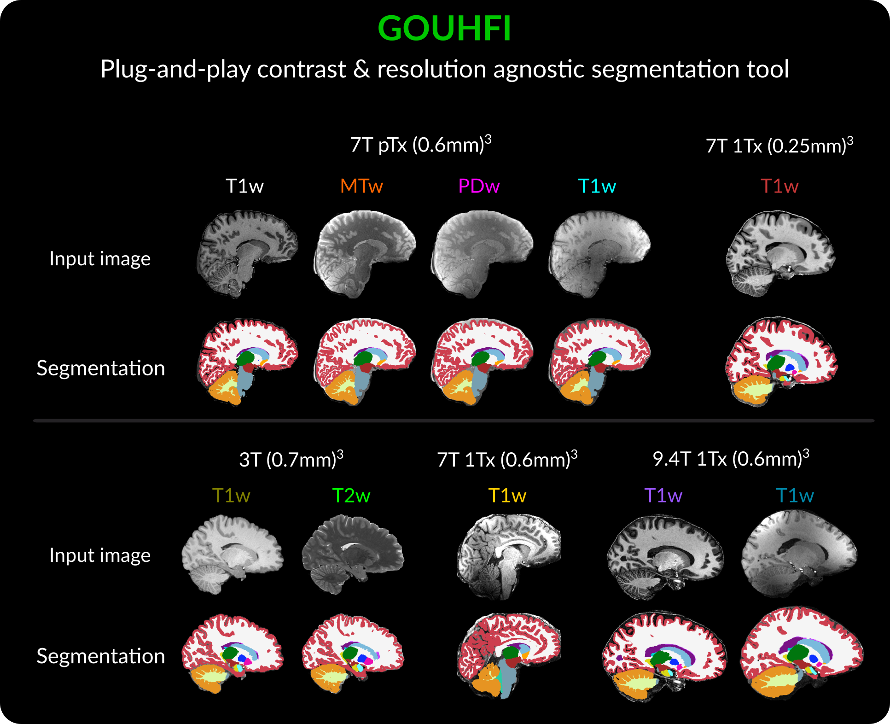

# GOUHFI: novel contrast- and resolution-agnostic segmentation tool for Ultra-High Field MRI

The Generalized and Optimized segmentation tool for Ultra-High Field Images (GOUHFI) is a deep learning-based fully automatic brain segmentation tool optimized for ultra-high field MRI (i.e., ≥ 7T MRI). Using the domain randomization approach proposed in [SynthSeg](https://github.com/BBillot/SynthSeg), GOUHFI is able to segment images of any contrast, resolution and field strength, making it broadly applicable across scanners, imaging protocols and centers. 



---

## How was GOUHFI developed?

- ***MAF: TO BE DONE More detailed explanation of what we did? [long abstract style]***
- This repository is based on the nnUNet v2 framework and uses the same naming convention and requirements for running inference and postprocessing.
- Robust 3D U-Net model trained using [nnU-Net v2](https://github.com/MIC-DKFZ/nnUNet)
- Domain randomization for contrast and resolution generalization
- Validated on both UHF (7T) and standard 3T MRI
- Easy-to-use CLI for inference
- Fully open-source and Pythonic

---

## Installation

### Step 0: Create a Python virtual environment

- As for any Python project, we highly recommend you to install GOUHFI inside a virtual environment. Whether you use pip, anaconda or miniconda is up to you. 

### Step 1: Install PyTorch 

- Follow the instructions on the [PyTorch website](https://pytorch.org/get-started/locally/).
- This step **has to be done before** step 2 below as recommended by the nnUNet team. See step #1 [here](https://github.com/MIC-DKFZ/nnUNet/blob/master/documentation/installation_instructions.md#installation-instructions).

### Step 2: Install the repository locally

#### Option 1: Install Directly from GitHub (Recommended)

```bash
pip install git+https://github.com/mafortin/GOUHFI.git
```

---

#### Option 2: Clone and Install Locally

```bash
git clone https://github.com/mafortin/GOUHFI.git
cd GOUHFI
pip install -e .
```

### Step 3: Download the trained model weights

1) A Zenodo link to the trained model weights is included in the repository under `trained_model/` subdirectory or simply with this [link](https://zenodo.org/records/15255556). This might require to have a Zenodo account (free).
2) Move this `GOUHFI.zip` in the `trained-model` folder.

### Step 4: Unzip the `GOUHFI.zip`

- To unzip `GOUHFI.zip`, use the following command:
```bash
cd /path/to/GOUHFI.zip
unzip GOUHFI.zip
```

- Once unzipped, you should have a folder called `Dataset014_gouhfi` with all trained folds and related files in the `trained_model` folder.


### Step 5: Test the installation

- In your terminal, type:

```bash
run_goufhi --help
```

- If you see the help function for `run_gouhfi`, you have installed the repository properly. Congrats and happy segmenting!

---


## Usage

### Run Inference

```bash
run_goufhi --input /path/to/input/folder/ --output path/to/output/folder/
```

| Argument  | Description                        |
|-----------|------------------------------------|
| `--input`  | Path to the directory containing the input image(s) to be segmented. |
| `--output` | Folder where the segmentations will be saved. |

- This command runs the model on your input image(s) and saves the corresponding output segmentations/label maps to the specified folder.
- Moreover, this command **needs** to be performed inside your newly created virtual python environment (see step 0 from [go to instllation](#installation)).

---

## Input Requirements

- File:
    - Format: compressed NIfTI (`.nii.gz`)
    - Naming convention: The nnUNet naming convention (i.e., `{CASE_IDENTIFIER}_0000.nii.gz`). More details [here](https://github.com/MIC-DKFZ/nnUNet/blob/master/documentation/dataset_format_inference.md).
    - If you want to segment >1 image/subject, all images should be inside the input directory defined by `--input` under distinctive filenames. The output segmentations will follow the same naming convention as the input filenames minus the `_0000` string.  

- Image:
    - Contrast: Any
    - Resolution: Any (resampling to isotropic resolution is processed internally. Not tested for highly anisotropic images, but always worth a try.)
    - Orientation: LIA (like FastSurfer [see the `conform_images` command])

---

## Output

File:
- `{CASE_IDENTIFIER}.nii.gz` —> Segmentation result/Label map for the `{CASE_IDENTIFIER}` subject.

Segmentation/Label map:
- The labels are linearly ordered from 0 (background) to 35. The complete list of labels is shown in file `misc/label-list-lut.txt`.
    - **Tip**: If you have a version of [*FreeSurfer*](https://surfer.nmr.mgh.harvard.edu/fswiki) installed with *Freeview*, you can easily visualize the segmentation outputs overlaid on your input images. In order to visualize the segmentations wih the same color scheme/lookuptable as used by the *FreeSurfer/FastSurfer* team, simply copy the `label-list-lut.txt` inside your `$FREESURFER_HOME/luts/` folder (label values are not the same, but the colors will be). Then, this new lookuptable should be available in your Colormap/Lookuptable dropdown menu.

---

## Citation

If you use **GOUHFI** in your research, please cite the following:

For the paper:
```
@article{fortin2025gouhfi,
  title={GOUHFI: a novel contrast- and resolution-agnostic segmentation tool for Ultra-High Field MRI},
  author={Fortin, Marc-Antoine et al.},
  journal={Imaging Neuroscience},
  year={2025}
}
```

For the trained model:
```
@misc{fortin2025gouhfi,
  author       = {Fortin, M.-A. and Larsen, M. and Kristoffersen, A. L. and Goa, P. E.},
  title        = {GOUHFI: Generalized and Optimized segmentation tool for Ultra-High Field Images},
  year         = {2025},
  publisher    = {Zenodo},
  doi          = {10.5281/zenodo.15255556},
  url          = {https://doi.org/10.5281/zenodo.15255556}
}
```

---

## Contributing

We welcome contributions. If you find bugs, have suggestions, or would like to extend the tool, feel free to open an issue or submit a pull request.

---

## License

This project is licensed under the Apache 2.0 License. See the `LICENSE` file for details.

---

## Third-Party softwares/librairies related to GOUHFI

This project incorporates code from the following projects, used under the Apache License 2.0:

- [FastSurfer/FastSurferVINN](https://github.com/Deep-MI/FastSurfer)
    - In this project, the script `conform.py` from FastSurfer/FastSurferVINN was used for 'conforming' the images to be segmented by GOUHFI (i.e., reorienting to LIA, resampling to isotropic resolution and normalizing signal values between 0 and 255). The script has been used as is, without modification, and is shared as part of the GOUHFI repository to make the repository more self-contained.
- [SynthSeg](https://github.com/BBillot/SynthSeg)
    - Used to generate the synthetic images for the training dataset.
- [nnU-Net v2](https://github.com/MIC-DKFZ/nnUNet)
    - For the training, inference, post-processing and evaluation of the 3D U-Net.

- [ANTsPyNet](https://github.com/ANTsX/ANTsPyNet)
    - For brain extraction only, **not** required for segmentation. Quick and efficient brain extraction tool if you need to do this to your data. Again, included for simplicity for the users.

---

## Maintainer

Marc-Antoine Fortin  
Norwegian University of Science and Technology (NTNU)  
Contact: [marc.a.fortin@ntnu.no](mailto:marc.a.fortin@ntnu.no)