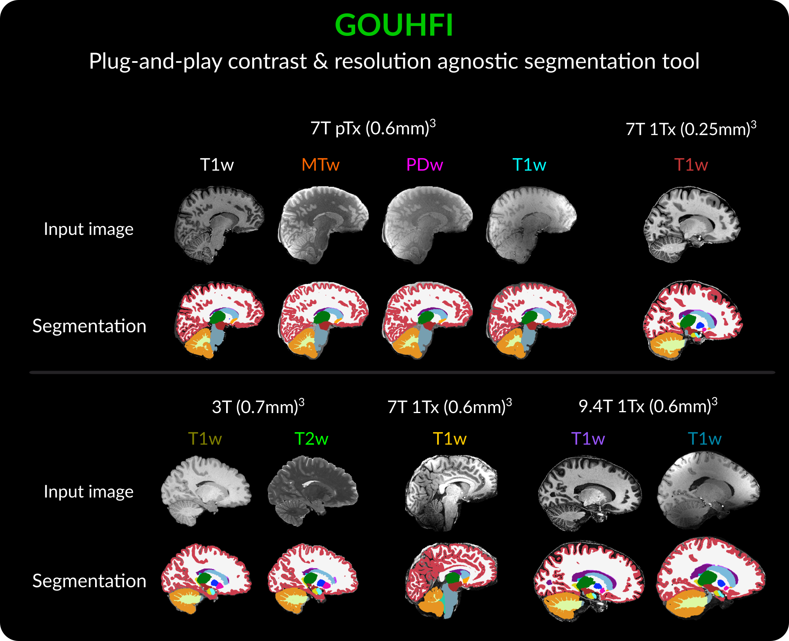

# GOUHFI: novel contrast- and resolution-agnostic segmentation tool for Ultra-High Field MRI
 
[](https://doi.org/10.5281/zenodo.17920473)

Welcome to **GOUHFI 2.0**, a novel deep learning (DL) toolbox for subcortical segmentation and cortical parcellation of brain MR images of **any** contrast, resolution or even field strength. 

This README provides instructions for [Installation](#installation), an overview of the main commands ([Usage](#usage)), [Related work](#third-party-softwares-related-to-gouhfi), [Citation](#citation), and [Licensing](#license). For the full command reference and detailed examples, please see **[`docs/usage.md`](docs/usage.md)**.

While the main goal of this repository is to share GOUHFI with the community, it also includes several helper commands for neuroscientists/imagers working with label maps (documented in **[`docs/usage.md`](docs/usage.md)**).


## Updates

- 13/12/25: **GOUHFI 2.0** is finally available! 
    - In addition of an improved subcortical segmentation tool on clinical cohorts, GOUHFI 2.0 now also offers (a) contrast-, resolution- and field-agnostic cortex parcellation following the Desikan-Killiany-Tourville (DKT) atlas and (b) Total Intracranial Volume (TIV) estimations for normalized volumetry analyses. 
    - The related publication will be released shortly.
 - 29/09/25: 🎉 **GOUHFI's paper has been accepted for publication in the _Imaging Neuroscience_ journal!** 🎉 The accepted version is available online [here](https://direct.mit.edu/imag/article/doi/10.1162/IMAG.a.960/133411/GOUHFI-a-novel-contrast-and-resolution-agnostic).

---

## How was GOUHFI developed?

GOUHFI is a fully automatic, contrast- and resolution-agnostic, DL-based brain segmentation tool optimized for Ultra-High Field MRI (UHF-MRI), while also demonstrating strong performance at 1.5T/3T compared to other well-established techniques. 

Using the domain randomization approach proposed in [SynthSeg](https://github.com/BBillot/SynthSeg) and a state-of-the-art 3D U-Net with Residual Encoders from the [nnUNetv2](https://github.com/MIC-DKFZ/nnUNet) framework, GOUHFI is able to handle various contrasts, resolutions and even field strengths without requiring fine-tuning or retraining. Tested on multiple datasets, it showed high accuracy and impressive robustness to noise and inhomogeneities, making it a valuable tool for neuroscientists working at both 3T and UHF-MRI. 

For more details on how GOUHFI was developed, please refer to the corresponding [paper](https://direct.mit.edu/imag/article/doi/10.1162/IMAG.a.960/133411/GOUHFI-a-novel-contrast-and-resolution-agnostic) published in Imaging Neuroscience.

More recently, we released a major update under the name **GOUHFI 2.0**. This new version retains the original subcortical segmentation approach, based on the same domain randomization principles, but benefits from an improved and expanded training dataset. In addition, **GOUHFI 2.0** introduces cortical parcellation and Total Intracranial Volume (TIV) estimation, enabling independent normalized volumetric analyses. Further details about the developement of GOUHFI 2.0 will be provided in an accompanying [ArXiv publication]() [**to be released shortly**].



---

## Installation

If you already have `conda` and `git` running on your device, the following installation procedure should be pretty straight forward. Helpful (hopefully) links were provided in some fo the steps to guide the user. GOUHFI has been successfully installed on Linux Ubuntu, Mac and Windows Operating Systems (OS).

### Step 1: Create a Python virtual environment

- As for any Python project, we highly recommend you to install GOUHFI inside a virtual environment. Whether you use pip, anaconda or miniconda is up to you, but the steps below use conda. Relevant links related to [conda](https://uoa-eresearch.github.io/eresearch-cookbook/recipe/2014/11/20/conda/) in general or [its installation](https://docs.conda.io/projects/conda/en/stable/user-guide/install/linux.html) for Ubuntu distributions (OS dependent).

- If you are using conda, you can use the following command: 
```bash
conda create --name gouhfi python=3.10 
```
- `gouhfi` in the above command line is the name of the virtual environment and can be replaced by anything else if preferred.
- Once your python virtual environment is created, you need to execute the remaining steps inside this virtual environment. Thus, activate the virtual environment by typing:
```bash
conda activate gouhfi
```

### Step 2: Install PyTorch 

- Inside your newly created python virtual environment run the following command:
```bash
pip install torch==2.1.2+cu121 torchvision==0.16.2+cu121 torchaudio==2.1.2+cu121 --index-url https://download.pytorch.org/whl/cu121
```
- **Note**: GOUHFI was tested for CUDA 11.8 and 12.1 and created with PyTorch 2.1.2. Other versions have **not** been tested.

### Step 3: Clone & install the repository locally

```bash
cd PATH/WHERE/THE/GOUHFI/DIRECTORY/WILL/BE/CREATED
git clone https://github.com/mafortin/GOUHFI.git
cd GOUHFI
pip install -e .
```

- where `PATH/WHERE/THE/GOUHFI/DIRECTORY/WILL/BE/CREATED` is the directory where a new directory called `GOUHFI` will be created from the `git clone` command. 
- The `pip install -e .` command allows you to install the GOUHFI repository in editable mode where you can modify the different scripts to your liking.
- **Note**: If you do not have git installed on your machine, you can manually download the ZIP file of the repository by clicking on the green `< > Code` dropdown menu on GitHub and click on the `Download ZIP` button. Once the download is completed, move the `.zip` file downloaded into the `PATH/WHERE/THE/GOUHFI/DIRECTORY/WILL/BE/CREATED` described above, extract/unzip the file and continue with the remaining installation steps from the `cd GOUHFI` and then `pip install -e .` command.

### Step 4: Download the trained model weights

1) A Zenodo link to the trained model weights is included in the repository in the `trained_model/gouhfi-trained-model-weights.md` file or simply with this [link](https://zenodo.org/records/15255556).
2) Move the three .zip files (`gouhfi_2p0_brain_seg.zip` [GOUHFI 2.0 subcortical segmentation], `gouhfi_2p0_parc.zip` [GOUHFI 2.0 cortical parcellation], and `GOUHFI.zip` [old GOUHFI 1.0 subcortical segmentation]) in the `trained-model` folder before unzipping it.

### Step 5: Unzip the `GOUHFI.zip`

- To unzip all three .zip files, use the following command:
```bash
cd trained_model/
unzip '*.zip'
```

- Once unzipped, you should have three folders: `Dataset014_gouhfi` [GOUHFI 1.0 subcort. seg.], `Dataset020_gouhfi_2p0n2` [GOUHFI 2.0 subcort. seg.] and `Dataset024_gouhfi_parc` [GOUHFI 2.0 cort. parc.]  with all of their five trained folds and related files for each inside the `trained_model` folder. This is the trained GOUHFI model.
- **Notes**: 
    - Since the three models are quite beefy (~7 Gb each), this step might last 6-7 minutes in total.
    - If you have manually extracted the ZIP files with your OS GUI (i.e., not using the unzip function shown above), be careful. It might have created an additional and unwanted directory called `GOUHFI` where the above-mentioned trained models are hidden inside. Manually move them back into `trained_model` if that's the case. 

### Step 6: Set GOUHFI's directory as an environment variable

- **Note**: If you are not familiar with how to setup environment variables for different OS or shell types, please refer to the [nnUNet documentation](https://github.com/MIC-DKFZ/nnUNet/blob/master/documentation/set_environment_variables.md) where they have examples for their environment variables for all OS types (Here you will do it for `GOUHFI_HOME` instead of their own environment variables).

- If you’re using Linux, open your `.bashrc` file by typing `nano ~/.bashrc` in the terminal, and then add the following line: 

```bash
export GOUHFI_HOME="/PATH/WHERE/THE/GOUHFI/DIRECTORY/WILL/BE/CREATED/GOUHFI"
```
- where `/PATH/WHERE/THE/GOUHFI/DIRECTORY/WAS/CREATED/GOUHFI` is the full path to your GOUHFI installation directory.
- **Note**: For Mac, it should be the `.zshrc` file instead of the `.bashrc` file.

- Now, either open a new terminal tab or source your `.bashrc` file in the same terminal tab by typing:
```bash
source ~/.bashrc
```
- **Note**: This will deactivate the `gouhfi` virtual environment, don't forget to reactivate it before using GOUHFI!

### Step 7: Test the installation

- In your terminal, type:

```bash
run_gouhfi --help
```

- **Note**: Remember to reactivate your GOUHFI virtual environment after sourcing the `.bashrc` file.
- If you see the help function for `run_gouhfi` (or any other functions related to GOUHFI described [below](#usage)), you have installed the repository properly. Congrats and happy segmenting! :)

---

## Usage


GOUHFI is operated through command-line tools installed with this repository (e.g., `run_gouhfi`, `run_preprocessing`, `run_renaming`, etc.).

- Full command reference and detailed examples are available in: **[`docs/usage.md`](docs/usage.md)**.
- Reminder: run all commands **inside your `gouhfi` virtual environment** (e.g., `conda activate gouhfi`).

### Quick start (minimum pipeline)

1) Preprocess raw images (conform + optional brain extraction):
```bash
run_preprocessing -i /path/to/raw_images -o /path/to/preprocessed_images
```

2) Rename images to the nnUNet naming convention (`{SUBJECT_ID}_0000.nii.gz`):
```bash
run_renaming -i /path/to/preprocessed_images -o /path/to/renamed_images
```

3) Run GOUHFI 2.0 (subcortical segmentation + cortical parcellation):

```bash
run_gouhfi -i /path/to/renamed_images
```

For input requirements, output folder structure, advanced flags (`--skip_seg`, `--cpu`, helper tools, volumetry, etc.), see **[`docs/usage.md`](docs/usage.md)**.

---

## Third-Party softwares related to GOUHFI

This project incorporates code from the following projects, used under the Apache License 2.0:

Image preparation/preprocessing:
- [ANTsPyNet](https://github.com/ANTsX/ANTsPyNet):
    - For brain extraction. Quick and efficient brain extraction tool (`antspynet.brain_extraction`) if you need to do this for your images to be segmented. 
    - We provide a script called `brain_extraction_antspynet.py` where we wrapped an unmodified implementation of `antspynet.brain_extraction` to make the repository more self-contained. 
    - If you have an already up and running ANTsPyNet installation, you can use it directly from there. In this repository, the function `run_brain_extraction` will execute this script.

Training:
- [nnU-Net v2](https://github.com/MIC-DKFZ/nnUNet):
    - The nnUNet v2 framework was used for training, inference, post-processing and evaluation of GOUHFI.
    - This repository contains the full nnUNetv2 directory (version [v2.4.1](https://github.com/MIC-DKFZ/nnUNet/releases/tag/v2.4.1)).
    - If you would like to reproduce the full training pipeline as explained in the GOUHFI paper (or retrain a model from scratch), you should be able to do so with GOUHFI's installation alone. 
        - However, we recommend the users to refer to the [nnUNet documentation](https://github.com/MIC-DKFZ/nnUNet/blob/master/documentation/) for more information on how to proceed since the documentation is not included in this repository.

Generating synthetic images for training:
- [SynthSeg](https://github.com/BBillot/SynthSeg):
    - The synthetic images used to train GOUHFI were generated from the generative model proposed in SynthSeg. 
    - Since SynthSeg is a complex beast on its own, we have decided to **not** include it in this repository. 
    - However, the approach used to create the synthetic training data for GOUHFI is very similar to the one shown in the [2-generation_explained.py](https://github.com/BBillot/SynthSeg/blob/master/scripts/tutorials/2-generation_explained.py) tutorial script available in the [SynthSeg GitHub repository](https://github.com/BBillot/SynthSeg). Thus, we recommend to people interested in reproducing the full pipeline with the synthetic image generation process to install SynthSeg on its own and follow their well designed tutorials.
        - Basically, by 
            1) Swapping the original *labels_classes_priors* files from SynthSeg in the [2-generation_explained.py](https://github.com/BBillot/SynthSeg/blob/master/scripts/tutorials/2-generation_explained.py) file by the ones shared in the [/misc/](https://github.com/mafortin/GOUHFI/tree/main/misc) subdirectory here in this repository (the four `.npy` files),
            2) setting the variable `n_neutral_labels` to 6 and `randomise_res` to False, and
            3) using the model parameters described in the appendices of the paper (under submission) for the generative model,
            - You can create synthetic images for label maps containing the 'Extra-Cerebral' label (see [run_add_label](#run_add_label) for how to perform this). 
    - More details about the generative model can be found in the [brain_generator.py](https://github.com/BBillot/SynthSeg/blob/master/SynthSeg/brain_generator.py) script and questions about the generative model should be addressed to the [SynthSeg team](https://github.com/BBillot/SynthSeg).

---

## Citation

If you use **GOUHFI** in your research, please cite the following:

### Papers:

- For the original GOUHFI paper published in _Imaging Neuroscience_:
```
Marc-Antoine Fortin, Anne Louise Kristoffersen, Michael Staff Larsen, Laurent Lamalle, Rüdiger Stirnberg, Pål Erik Goa; GOUHFI: A novel contrast- and resolution-agnostic segmentation tool for ultra-high-field MRI. Imaging Neuroscience 2025; 3 IMAG.a.960. doi: https://doi.org/10.1162/IMAG.a.960
```
- Bibtex entry:
```
@article{fortin2025gouhfi,
    author = {Fortin, Marc-Antoine and Kristoffersen, Anne Louise and Larsen, Michael Staff and Lamalle, Laurent and Stirnberg, Rüdiger and Goa, Pål Erik},
    title = {GOUHFI: A novel contrast- and resolution-agnostic segmentation tool for ultra-high-field MRI},
    journal = {Imaging Neuroscience},
    volume = {3},
    pages = {IMAG.a.960},
    year = {2025},
    month = {10},
    issn = {2837-6056},
    doi = {10.1162/IMAG.a.960},
    url = {https://doi.org/10.1162/IMAG.a.960},
    eprint = {https://direct.mit.edu/imag/article-pdf/doi/10.1162/IMAG.a.960/2556634/imag.a.960.pdf},
}

```

- For GOUHFI 2.0, currently on ArXiV [will be added shortly]:
```

```
- Bibtex entry:
```

```

### Models:

- For the original GOUHFI subcortical segmentation model:
```
@misc{fortin2025gouhfi,
  author       = {Fortin, M.-A. and Larsen, M. and Kristoffersen, A. L. and Goa, P. E.},
  title        = {GOUHFI: Generalized and Optimized segmentation tool for Ultra-High Field Images},
  year         = {2025},
  publisher    = {Zenodo},
  version      = {1.0.0},
  doi          = {10.5281/zenodo.15255556},
  url          = {https://doi.org/10.5281/zenodo.15255556}
}
```

- For GOUHFI 2.0 subcortical segmentation and/or cortical parcellation models:
```
@misc{fortin2025gouhfi_2p0,
  author       = {Fortin, M.-A. and Larsen, M. and Kristoffersen, A. L. and Goa, P. E.},
  title        = {GOUHFI 2.0: Generalized and Optimized segmentation tool for Ultra-High Field Images},
  year         = {2025},
  publisher    = {Zenodo},
  version      = {2.0.0},
  number       = {3},
  doi          = {10.5281/zenodo.17920473},
  url          = {https://doi.org/10.5281/zenodo.17920473}
}

```
---

## Contributing

We welcome contributions. If you find bugs, have suggestions, or would like to extend the tool, feel free to open an issue or submit a pull request.

---

## License

This project is licensed under the Apache 2.0 License. See the `LICENSE` file for details.

---

## Maintainer

[Marc-Antoine Fortin](https://www.ntnu.no/ansatte/marc.a.fortin)  
Norwegian University of Science and Technology (NTNU)  
Contact: [marc.a.fortin@ntnu.no](mailto:marc.a.fortin@ntnu.no)
